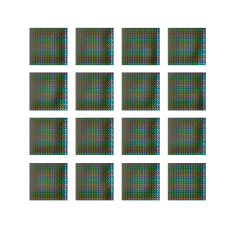

# Face-Gan

GAN network for generating random faces using a 100 seed vector using the faces in the wild dataset

The images generated can be enhanced using a bigger network with better images. Also the images can be imporved by training for more number of epochs. I have used 200 as it was taking a long time. Also speed can be increased by removing the visualization function - 'generate_and_save_output()' as it is using the predict method for 16 inputs and slows down the training.
